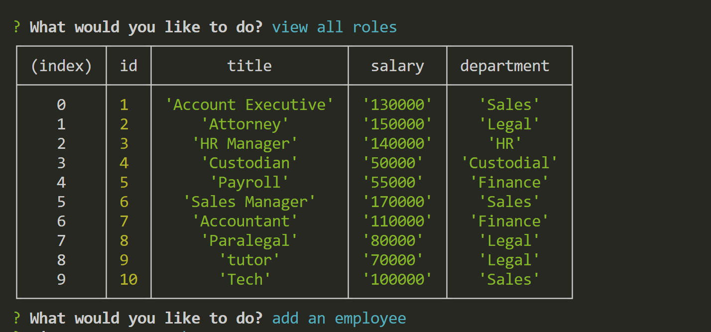

# Company-Database

## Description
Creating a database that will allow me to view and manage departments, roles, and employees in a company.

## Installation
* Express 4.18.2
* Inquirer 8.2.4
* Mysql2 3.9.1

## Usage
* You will need to install the dependencies in your package.json. 
* Source all sql files before running the application in your terminal.
* Video Link: https://drive.google.com/file/d/1uNpuW_IIeNMtH0GFl4tYLuX6VeXiYA9m/view 

 ## Screenshot
 

 ## License
 MIT

 ## Contributing
 Click my Github link to add or contribute to the repository.
  * GitHub: https://github.com/JennaJay/Company-Database 